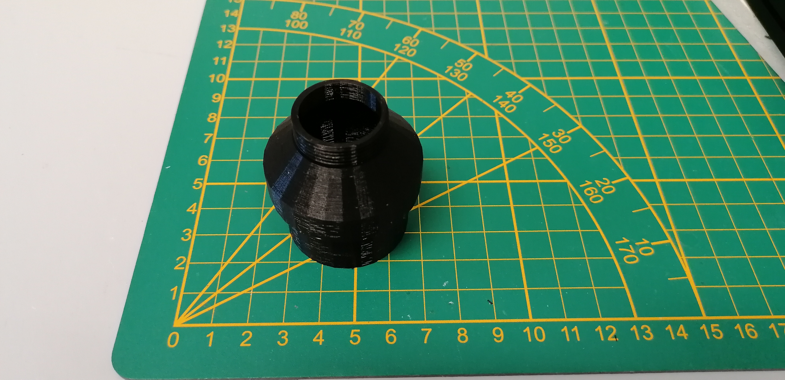
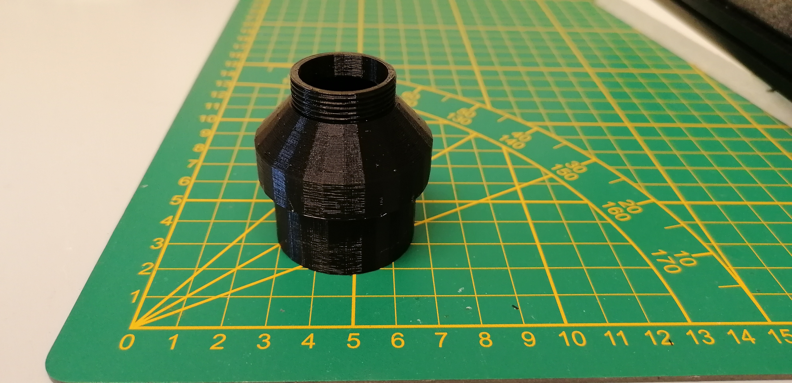

# flir-blackfly-s-adapter

### an adapter for a Flir blackfly camera

This is a simple 3D printed adapter to connect a Flir BlackFly S camera to the camera port of a microscope.

The camera port has an internal diameter of 38mm and a 1.25X objective installed inside. 

The camera itself has a c-mount thread.

|||
|--|--|
|||

### Dependencies:

- Thread openScad library:
  - https://github.com/rcolyer/threads-scad

